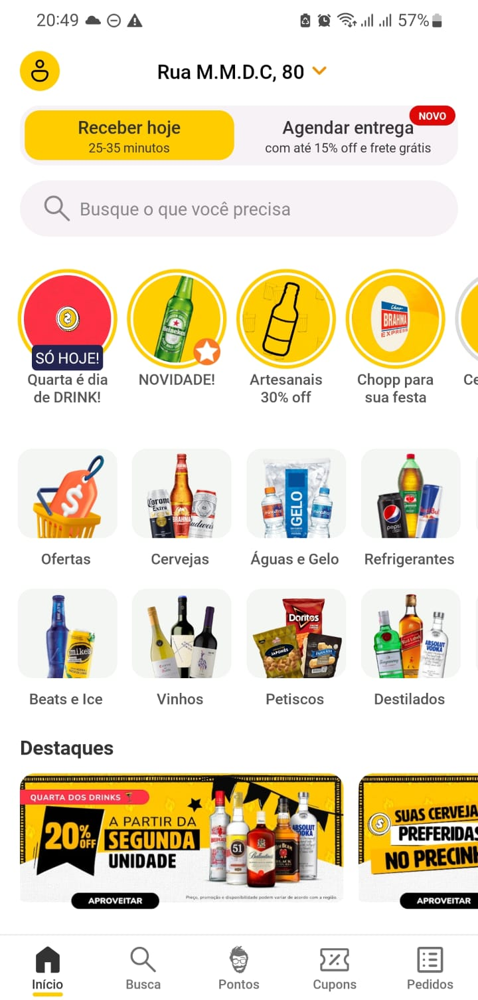
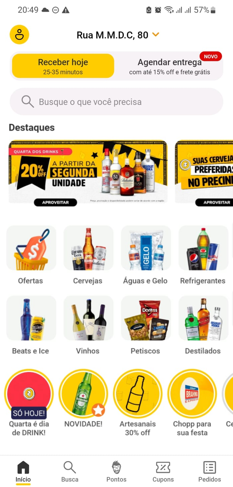

# Atividade sobre tópicos de UX do módulo 10

### Aluno 🧑‍🎓
- Pedro de Carvalho Rezende

### Professores 👨‍🏫👩‍🏫
- Bruna Mayer
- Sergio Venâncio

## Objetivo 🎯

O objetivo desta atividade é medir o conhecimento sobre os tópicos de UX do módulo 10, a saber: User Research, Métodos Mistos, Framework HEART, Arquitetura de Informação, Design de Interfaces e UX Writing.

## Instruções 🕹️

- Crie um documento de texto no editor e formato de sua preferência e identifique-se.
- Você deve escolher uma interface de algum produto ou serviço digital de sua preferência (ex. aplicativo do Uber) - indique o link do produto/serviço logo no início
- Você deve escrever um breve texto justificando sua escolha, que deverá se pautar em observação de algum problema de experiência do usuário nesse produto/serviço. 
    - O propósito deste trabalho é transformarmos observações de problemas em hipóteses, e então testá-las.
- Prepare-se para tirar prints do uso deste produto/serviço, para ilustrar seu trabalho.

 

# Parte 1: Análise HEART e GSM + proposta de coleta de dados 💖

## Barema 📃
- Você deve produzir uma análise HEART + GSM do produto/serviço escolhido, 
    - com base no problema de experiência do usuário observado, 
    - identificando o máximo possível de elementos do framework HEART, 
    - listando objetivos, sinais e métricas de cada elemento mapeado;

- A partir da sua análise, você deve fazer uma proposta de coleta de dados quantitativa em ferramenta de sua escolha (ex. Google Analytics, Hotjar, Forms etc.), que vise compreender melhor o problema observado. 
    - Sua proposta deve indicar hipóteses, 
    - quais dados devem ser coletados para testar tais hipóteses, e 
    - as justificativas/motivações dessa hipótese/coleta (com base na análise HEART + GSM);

- **A avaliação será envolta da**:
    - completude da análise (se você deixar de identificar algum elemento HEART que poderia ser mapeado, haverá demérito);
    - coerência da análise e da proposta (se você justificar algum elemento, seu objetivo, sinal ou métrica de forma equivocada ou ilógica, haverá demérito; 
    - se você listar hipóteses/propostas de coleta de dados que não são devidamente justificadas conforme análise HEART, haverá demérito); 
- **Dica**: estabeleça uma Persona e crie um mapa de Jornada do Usuário (ou mesmo um Blueprint de Serviço) para facilitar o apontamento de sinais e métricas da sua análise.

## Entrega da Parte 1 (corrigida 👌)

### Interface do serviço digital escolhido: 
- App e Web serviço do Zé Delivery 
- Link do serviço, para web (o app é baixar na store do IoS ou Android): [Zé Delivery](https://www.ze.delivery/)

### Justificativa da escolha do serviço digital:

O Zé Delivery é um serviço de entrega de bebidas alcoólicas que se tornou muito popular no Brasil, principalmente durante a pandemia. Decidi escolher esse serviço para a atividade por causa de um problema que enfrentei ao usar o aplicativo. Identifiquei três problemas principais:

1. **Lentidão no carregamento**: O primeiro problema foi a grande lentidão no carregamento de qualquer tipo de processo dentro do aplicativo, algo que não acontece na versão web. Ganhei um cupom de 30 reais em um evento do Inteli e, ao tentar usá-lo, fiquei tão estressado que quase desisti.

2. **Recarregamento da tela**: O segundo problema foi o recarregamento da tela do aplicativo. Quando eu entrava no app, ele às vezes reiniciava, saindo da tela onde eu estava e voltando ao início.

3. **Questões de UX/UI**: O terceiro problema foi uma questão de UX/UI. Tanto no serviço web quanto no aplicativo, há uma apresentação de tipos de produtos e uma área de destaque com promoções. Minha compra, com o cupom de desconto, foi justamente de um produto em promoção nessa área, um produto que eu gosto muito. A questão é a forma como apresentaram essa área de destaque, que não é a primeira coisa que o usuário vê ao entrar no app.

Com base nesses pontos, minha experiência com o Zé Delivery no aplicativo foi bastante frustrante, destacando a necessidade de melhorias na performance e na usabilidade do app.

- Aqui pela imagem, vemos que a área de destaque está no final da visualização inicial, tanto para Web quanto para o App, fazendo com que não seja o real "destaque" que deveria ser para o usuário.

### Persona + Jornada do Usuário
Tendo em vista que estou abordando um problema em que a seção de destaques/promoções não está atraindo a atenção dos usuários como esperado, possivelmente devido a problemas de carregamento ou visibilidade. Vou criar uma persona para ajudar a entender melhor o público-alvo e suas possíveis necessidades:

- Nome: João Silva
- Idade: 28 anos
- Ocupação: Analista de TI
- Trabalho: Trabalha em uma empresa de tecnologia e gosta de relaxar com os colegas após o expediente.
- Objetivo: Encontrar promoções de bebidas, rapidamente, para uma festa de entrada dos últimos funcionários do mês.

Para mapear a jornada do usuário, vou considerar o seguinte cenário:

1. **Descoberta**: João entra no aplicativo do Zé Delivery para encontrar bebidas para a festa.
2. **Exploração**: Ele navega pelas categorias de bebidas e procura por promoções.
3. **Seleção**: João encontra uma promoção de sua bebida favorita e tenta adicionar ao carrinho.
4. **Problema**: Ele enfrenta problemas de lentidão no carregamento e recarregamento da tela, o que o impede de concluir a compra.
5. **Frustração**: João fica frustrado com a experiência e considera abandonar o aplicativo.
6. **Decisão**: Ele decide procurar outra opção de promoção para comprar as bebidas.
7. **Abandono**: Ele não encontra nenhuma promoção satisfatória e decide sair do aplicativo e procurar outra opção para comprar as bebidas.

### Análise HEART e GSM

As correções foram feitas com base no feedback recebido. Aqui está a análise HEART e GSM revisada para o Zé Delivery:

| HEART         | Goals                             | Signals                                                                                       | Metrics                                                               |
|---------------|-----------------------------------|-----------------------------------------------------------------------------------------------|----------------------------------------------------------------------|
| **Happiness**     | Usuários acreditam que o fluxo do web/app está fácil de entender	  | Feedback direto sobre a interface do usuário, taxa de satisfação em pesquisas de usuário, taxa de rejeição	                                   | Níveis das taxas de reijeição por processos do site (compra, entrada em certas etapas, etc.) |
| **Engagement**    | Usuários com diversidade de compras no site/app	 | Tempo de permanência no app/site, número de páginas visitadas, acesso a diferente categorias de produtos	                                   | Tempo médio de permanência, páginas visitadas por sessão           |
| **Adoption**      | Aumento no número de novos usuários e pedidos, além do número de permanência deles no aplicativo	   | Cadastros novos, número de primeiros pedidos, tempo médio de permanência na plataforma, pós cadastro	    | Novos cadastros por mês, número de primeiros pedidos, aumento na permanência do site, pós cadastro|
| **Retention**     | Usuários retornando à plataforma para fazerem mais pedidos   | Número de usuários que fazem pedidos recorrentes, frequência de pedidos	 | Taxa de retenção de clientes, frequência média de pedidos por usuário, menor taxa de rejeição |
| **Task Success**  | Conclusão bem-sucedida de pedidos	     | Número de pedidos completados sem problemas, baqixo nível de erros reportados nas finalizações de pedidos	         | Taxa de sucesso de pedidos, número de problemas por pedido, taxa de rejeição |

**Detalhamento das sugestões**:
- **Happiness**: Visualizar os números perante a taxa de rejeição por processos do site, como a compra, a entrada em certas etapas, etc., me ajudará a identificar onde os usuários estão enfrentando problemas e aprimorar a experiência do usuário.
- **Engagement**: Monitorar o tempo médio de permanência e o número de páginas visitadas por sessão me ajudará a entender o nível de engajamento dos usuários e a identificar áreas de interesse para melhorar a navegação.
- **Adoption**: Acompanhar o crescimento de novos usuários e o número de permanência deles no aplicativo são indicadores importantes para entender como novos usuários estão adotando o serviço e como está a adaptação com o uso da interface.
- **Retention**: A taxa de retenção de clientes e a frequência média de pedidos por usuário me ajudarão a avaliar a fidelidade dos usuários e a identificar oportunidades para melhorar a retenção.
- **Task Success**: Monitorar a taxa de sucesso na finalização de pedidos e o número de problemas reportados me ajudará a avaliar a eficiência operacional e a satisfação do cliente no uso da plataforma.

--- 

### Proposta de coleta de dados quantitativa com DataDog
Para aprimorar a coleta de dados quantitativos e alinhar com a minha preferência em usar o DataDog, revisei a estratégia de coleta de dados para incluir métricas detalhadas que podem ser capturadas em tempo real. Este ajuste não só melhora a precisão da análise, mas também otimiza a resposta a problemas identificados, maximizando a eficácia do aplicativo. Aqui está a minha proposta revisada usando a ferramenta DataDog para coletar dados quantitativos:

#### Hipóteses

1. **Hipótese 1**: A lentidão no carregamento do aplicativo está afetando a satisfação do usuário
    - **Justificativa**: A lentidão pode causar frustração e levar os usuários a abandonar o uso do aplicativo, afetando diretamente a satisfação do usuário. Como mostrado na jornada do usuário, a lentidão pode impedir a conclusão de pedidos e resultar em uma experiência negativa.

2. **Hipótese 2**: O recarregamento da tela está afetando o engajamento do usuário
    - **Justificativa**: Interrupções no uso, como reinicializações de tela, podem diminuir o engajamento e confundir os usuários, levando a uma experiência de uso negativa. Isso pode resultar em uma menor permanência no aplicativo e uma menor taxa de conversão.

3. **Hipótese 3**: A apresentação da área de destaque não está sendo eficaz
    - **Justificativa**: Se as promoções e descontos em destaque não são imediatamente visíveis ou atraentes, isso pode resultar em uma menor conversão de vendas e impactar a percepção de valor do aplicativo. Como demonstrado na experiência do João, a área de destaque não está sendo eficaz em atrair a atenção dos usuários.

#### Coleta de dados com a ferramenta DataDog

1. **Tempo médio de carregamento do aplicativo por permanência do usuário**:
    - **Métrica**: Monitorar o tempo de load das páginas por sessão do usuário.
    - **Objetivo**: Identificar e minimizar picos de lentidão do load das diferentes páginas presentes durante a navegação para melhorar a experiência do usuário. Sendo possível de fazer isso a partir do cruzamento entre o tempo de carregamento da página e a permanência do usuário durante esse período.

2. **Taxa de abandono da aplicação**:
    - **Métrica**: Percentual de sessões abandonadas antes da conclusão de um pedido.
    - **Objetivo**: Determinar o impacto da performance na decisão de continuar ou abandonar o aplicativo.

3. **Engajamento do usuário (sessões interrompidas)**:
    - **Métrica**: Número de reinicializações de tela por sessão.
    - **Objetivo**: Quantificar e reduzir as interrupções no engajamento para proporcionar uma experiência mais fluída.

4. **Visualizações da área de destaque**:
    - **Métrica**: Cliques em itens destacados versus visualizações totais da página.
    - **Objetivo**: Avaliar a eficácia visual e de interação das áreas de destaque, ajustando-as conforme necessário para maximizar a atração do usuário.

5. **Conversão de vendas nas áreas de destaque**:
    - **Métrica**: Número de compras realizadas através das promoções destacadas.
    - **Objetivo**: Medir a eficácia das campanhas promocionais em destaque e otimizar a apresentação para aumentar as vendas.

Utilizando o DataDog, posso monitorar esses aspectos em tempo real e integrar diferentes fontes de dados para uma análise mais robusta, proporcionando insights mais profundos e permitindo uma resposta ágil às necessidades dos usuários.

### Conclusão da Parte 1

A análise HEART e GSM do Zé Delivery me permitiu identificar áreas-chave para melhorar a experiência do usuário e definir objetivos e métricas específicas para avaliar o desempenho do aplicativo. Com base nas hipóteses levantadas, propus uma estratégia de coleta de dados quantitativos com a ferramenta DataDog para monitorar a performance do aplicativo e a eficácia das áreas de destaque. Essa abordagem me ajudará a identificar problemas, otimizar a experiência do usuário e aumentar a satisfação e o engajamento dos usuários.
Dessa forma, situações como apresentadas na jornada do usuário do João Silva poderão ser evitadas, proporcionando uma experiência mais fluida e agradável para os usuários do Zé Delivery.

---

# Parte 2: Proposta de melhoria na interface com base em pesquisa qualitativa 📊

## Barema 📃

- Você deve seguir um caminho qualitativo e realizar testes de usabilidade sobre o produto/serviço escolhido, testando hipóteses levantadas pelas métricas da análise HEART + GSM que forem mais estratégicas (não precisa ser todas). 
    - Você deve descrever ao menos um enunciado de tarefa a ser cumprida sobre a interface e;
    - realizar entre 3 a 5 testes com pessoas que seriam típicas usuárias dessa interface;

- Com base no resultado dos testes, você deve fazer uma proposta simplificada de mudança nessa interface. 
    - Você pode fazer isso através de uma imagem ou um conjunto de imagens, um "protótipo" de interface que represente e demonstre a alteração proposta. 
    - Sua proposta deve estar relacionada a alterações de Arquitetura de Informação, Design de Interface e/ou UX Writing. 
    - Você deve apresentar o protótipo e escrever junto a ele um texto com novas hipóteses, desta vez sobre melhorias da interface, justificando cada alteração com uma hipótese e de acordo com os aprendizados do módulo até então;

- **A avaliação será envolta da**: 
    - coerência e organização dos testes de usabilidade (os enunciados de tarefas devem ser claros e objetivos, bem contextualizados em relação às hipóteses, e que definam bem quem irá testar. Caso algo dentre todos esses itens não ocorra, haverá demérito);
    - aplicação dos testes e coleta de dados (caso não existam evidências dos dados coletados e/ou não existam indicações de problemas, haverá demérito.);
    - coerência entre hipóteses e protótipo (se você listar hipóteses que não possuem alteração na interface correspondente, ou propor interface com  alterações que não façam sentido lógico para testar suas respectivas hipóteses, haverá demérito)

# Entrega da Parte 2 📈

## Pesquisa Qualitativa 🔍

Como forma de validar as hipóteses levantadas anteriormente e identificar oportunidades de melhoria na interface do Zé Delivery, realizei testes de usabilidade com 4 usuários "típicos" (foram pessoas mais próximas de mim, para ser sincero 😣) do aplicativo. Cada usuário foi convidado a realizar uma tarefa específica no aplicativo, a qual eu havia pré-preparado, enquanto eu observava e registrava suas interações e feedbacks.

**IMPORTANTE**: As etapas/tarefas foram propostas e analisadas para o aplicativo e não a interface web, já que é mais comum o uso do aplicativo.

Para visualização dos testes qualitativos feitos, a partir do template disponibilizado pelos professores, acesse o link a seguir: [Testes de Usabilidade](https://docs.google.com/spreadsheets/d/1zzG-yrXwoUnqQjHe_98IrLnx-eUzHSS1vj8AczMtI7s/edit?usp=sharing)

### Insights
- Para os testes, tentei desenvolver um fluxo linear de um usuário comum do Zé Delivery, desde a abertura do aplicativo até a finalização de um pedido. Abaixo, irei colocar as principais "reclamações"/insights sobre as ações dos usuários:
1. **Lentidão no carregamento**: Todos os usuários relataram que o aplicativo estava lento ao carregar as páginas, o que causou frustração e atrasou a conclusão da tarefa.
2. **Recarregamento da tela**: Dois usuários experimentaram o recarregamento da tela ao navegar pelo aplicativo, o que os fez perder o progresso e ter que começar de novo.
3. **Área de destaque**: A área de destaque com promoções não foi imediatamente visível para todos os usuários, o que resultou em uma menor interação com as promoções.

### Relação com as hipóteses

1. **Hipótese 1**: A lentidão no carregamento do aplicativo está afetando a satisfação do usuário
    - **Resultado dos testes**: Todos os usuários relataram lentidão no carregamento, principalmente na parte de confirmação do pedido, o que causou frustração e atrasou a conclusão da tarefa.
    - **Justificativa**: A lentidão no carregamento pode impactar diretamente a satisfação do usuário e a eficiência do aplicativo.

2. **Hipótese 2**: O recarregamento da tela está afetando o engajamento do usuário
    - **Resultado dos testes**: Todos os usuários experimentaram o recarregamento da tela, ao fazer cadastro/login, causando estranhamento e leve estresse.
    - **Justificativa**: Interrupções no uso, como reinicializações de tela, podem diminuir o engajamento e confundir os usuários, levando a uma experiência de uso negativa.

3. **Hipótese 3**: A apresentação da área de destaque não está sendo eficaz
    - **Resultado dos testes**: A área de destaque com promoções não foi imediatamente visível para todos os usuários, o que resultou em uma menor interação com as promoções.
    - **Justificativa**: Se as promoções e descontos em destaque não são imediatamente visíveis ou atraentes, isso pode resultar em uma menor conversão de vendas e impactar a percepção de valor do aplicativo.

## Proposta de Melhoria na Interface 🛠️

### Contexto sobre a mudança proposta na interface

Primeiramente, a partir dos insights obtidos nos testes de usabilidade, fica claro que a lentidão no carregamento, o recarregamento da tela e a falta de destaque nas promoções são problemas significativos que afetam a experiência do usuário no Zé Delivery. Porém, para dois desses problemas, a lentidão e o recarregamento, a solução é mais técnica e envolve a otimização do aplicativo. Portanto, para esta proposta de melhoria, vou focar na questão da apresentação da área de destaque, que pode ser resolvida com mudanças na interface.

### Demonstração de uma possível navegação simples do usuário, focado nos botões de destaque

<video controls>
  <source src="assets/video_ze.mp4" type="video/mp4">
  Your browser does not support the video tag.
</video>

### Mudanças efetuadas na interface - **Arquitetura de Informação**

Tela orginal - A:

Tela com as mudanças - B:

### Explicação das mudanças

1. **Posicionamento das Promoções e Ofertas:**
   - **Tela A:** As promoções e ofertas aparecem no final da tela, após as categorias de produtos.
   - **Tela B:** As promoções e ofertas aparecem logo abaixo da barra de busca, antes das categorias de produtos.

2. **Destaque das Promoções:**
   - **Tela A:** As promoções estão posicionadas em um banner na parte inferior da tela.
   - **Tela B:** As promoções estão em ícones circulares e coloridos, dando maior destaque visual.

3. **Chamadas para Ação:**
   - **Tela A:** Apenas botões de "Receber hoje" e "Agendar entrega" são destacados na parte superior.
   - **Tela B:** Ícones de promoções e novidades recebem igual destaque aos botões de ação.

### Potenciais Benefícios das Mudanças

As mudanças propostas na Tela B trazem diversos benefícios potenciais para a experiência do usuário e para o desempenho do aplicativo. Uma das principais melhorias é a visibilidade das promoções. Ao colocar as promoções logo abaixo da barra de busca e em ícones circulares coloridos, as ofertas tornam-se mais atraentes e visíveis para os usuários, aumentando a probabilidade de interação com promoções especiais do dia.

A navegação também se torna mais intuitiva com uma estrutura mais limpa e menos elementos redundantes. Essa reorganização permite que os usuários encontrem o que procuram com maior facilidade, o que melhora a experiência de uso de maneira significativa. Além disso, a maior visibilidade das promoções e a navegação facilitada podem levar a um aumento nas conversões, tanto em compras imediatas quanto no engajamento com as ofertas.

Uma interface mais clara e organizada proporciona uma experiência mais satisfatória e menos frustrante para os usuários, o que pode aumentar a retenção de clientes e a fidelidade ao aplicativo. A ênfase nas ofertas diárias, como "Quarta é dia de DRINK!", pode incentivar compras baseadas em promoções especiais, resultando em um aumento nas vendas em dias específicos.

**Hipótese**: A reorganização dos elementos na tela de destaque aumentará a visibilidade das promoções e melhorará a interação dos usuários.
    - **Justificativa**: Ao reorganizar os elementos na tela de destaque, colocando as promoções em uma posição mais proeminente e de fácil acesso, os usuários terão uma maior chance de visualizar e interagir com as promoções, aumentando assim a conversão de vendas.